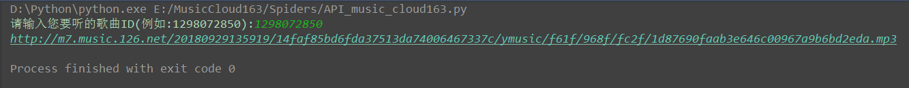

网易云音乐歌曲下载 
===========================
   
### 网易云音乐官网 - https://music.163.com/
|Author|:sunglasses:Henryhaohao:sunglasses:|
|---|---
|Email|:hearts:1073064953@qq.com:hearts:

    
****
## :dolphin:声明
软件均仅用于学习交流，请勿用于任何商业用途！感谢大家！
## :dolphin:介绍
该项目为[网易云音乐](https://music.163.com/)歌曲下载
- 项目介绍:通过传入歌曲ID爬取指定的歌曲MP3下载地址
- 爬虫文件:Spiders目录下的music_cloud163.py
- 解密文件:Spiders目录下的core.js;网易云音乐为RSA非对称加密
## :dolphin:运行环境
Version: Python3
## :dolphin:安装依赖库
```
pip3 install -r requirements.txt
```
## :dolphin:运行截图
 - 获取歌曲ID


> - 运行



